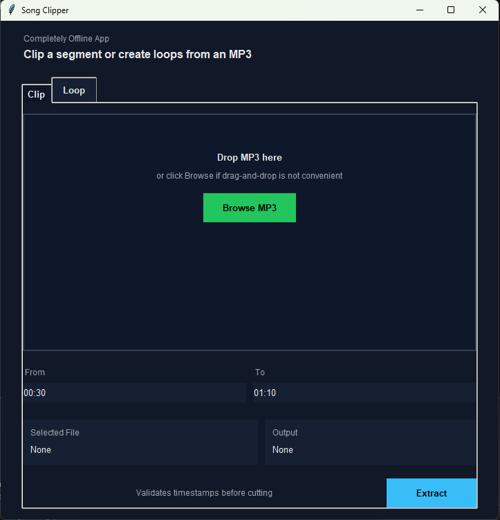
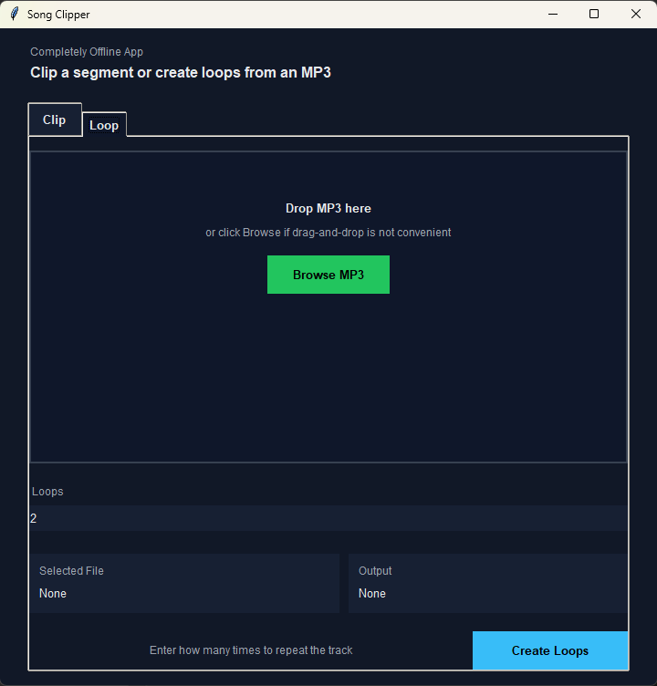

# Song Clipper 🎵

A lightweight, completely **offline** Windows desktop app for MP3 workflows: clipping segments and creating looped tracks.

## Overview





Song Clipper provides a simple, dark-themed interface for MP3 workflows. Drop your audio file, then use one of the built-in workflows to generate an output file saved next to the original with a descriptive filename.

## Features

✅ **Completely Offline** - No internet required  
✅ **Drag & Drop** - Simply drop an MP3 file into the window  
✅ **Dark Mode UI** - Clean, modern dark-themed interface  
✅ **Simple Workflow** - Select timestamps → Click Extract → Done  
✅ **Self-Contained** - No system Python installation required  
✅ **Auto-Naming** - Output files saved next to source with descriptive names  
✅ **Privacy First** - Collects no user data, zero telemetry, no network calls ever

New in v2:
- Loop workflow: repeat an MP3 N times into a single output file (saved next to the source as `<name>-loopxN.mp3`).

## Quick Start

### Prerequisites

- **Windows** (7 or later)
- **FFmpeg** - Either system-installed or bundled locally

### Installation

1. Clone this repository:
   ```bash
   git clone https://github.com/09ashishkapoor/music_clipper_local_offline.git
   cd music_clipper_local_offline
   ```

2. **Set up FFmpeg** (choose one):

   **Option A: System FFmpeg (Recommended)**
   - Download from [ffmpeg.org](https://ffmpeg.org/download.html) or use WinGet:
     ```bash
     winget install Gyan.FFmpeg
     ```
   - App will automatically detect it in your PATH

   **Option B: Local FFmpeg**
   - Download FFmpeg build from [gyan.dev](https://www.gyan.dev/ffmpeg/builds/)
   - Extract `ffmpeg.exe` and `ffprobe.exe` to:
     ```
     tools/ffmpeg/
     ```

3. **Run the app:**
   ```bash
   run_song_clipper.bat
   ```

   Or directly with Python:
   ```bash
   python app/main.py
   ```

## Usage

1. **Launch** the app via `run_song_clipper.bat`
2. **Drop** an MP3 file into the drop zone (or click "Browse MP3")
3. **Enter timestamps** in `MM:SS` or `HH:MM:SS` format:
   - `From` - Start of the segment
   - `To` - End of the segment
4. **Click Extract** - The clipped file is saved next to the original

### Example

**Input file:** `meditation-track.mp3`  
**From:** `00:30` | **To:** `01:10`  
**Output file:** `meditation-track-00-30-to-01-10.mp3`

If the output already exists, a number is appended: `meditation-track-00-30-to-01-10-1.mp3`

### Loop workflow

1. Switch to the **Loop** tab
2. **Drop** an MP3 file into the drop zone (or click "Browse MP3")
3. **Enter Loops** (whole number, `>= 1`)
4. **Click Create Loops** - The looped file is saved next to the original

### Loop example

**Input file:** `meditation-track.mp3`  
**Loops:** `5`  
**Output file:** `meditation-track-loopx5.mp3`

## Project Structure

```
music_clipper_local_offline/
├── app/                      # Application code
│   ├── main.py              # Entry point and bootstrapping
│   ├── ui.py                # GUI layout and event handling
│   ├── cutter.py            # FFmpeg integration and audio processing
│   ├── validation.py        # Timestamp validation and parsing
│   ├── theme.py             # Dark mode color constants
│   └── __pycache__/         # Python cache (ignored in git)
│
├── tools/
│   └── ffmpeg/              # FFmpeg binaries (user-provided or system-installed)
│       ├── ffmpeg.exe       # Audio processing engine
│       └── ffprobe.exe      # File metadata reader
│
├── docs/
│   └── superpowers/         # Design specifications
│
├── run_song_clipper.bat     # Windows launcher script
├── requirements.txt         # Python dependencies
├── .gitignore              # Git ignore patterns
└── README.md               # This file
```

## Requirements

### Python Dependencies

```
tkinterdnd2-universal>=1.7.3  # Drag-and-drop support
```

See `requirements.txt` for details.

### System Requirements

- **Python 3.8+** (or embedded runtime)
- **FFmpeg** (system or local)
- **Windows OS**
- **~50 MB disk space** (excluding FFmpeg binaries)

## Development

### Setting up a development environment

1. Clone the repository
2. Create a Python virtual environment:
   ```bash
   python -m venv venv
   venv\Scripts\activate
   ```

3. Install dependencies:
   ```bash
   pip install -r requirements.txt
   ```

4. Run the app:
   ```bash
   python app/main.py
   ```

### Architecture

- **UI Layer** (`ui.py`) - Handles window layout, drag-and-drop, user input, and status updates
- **Service Layer** (`cutter.py`, `validation.py`) - Audio processing logic, timestamp parsing, and file naming
- **Theme** (`theme.py`) - Centralized dark mode color constants
- **Launcher** (`run_song_clipper.bat`) - Resolves Python runtime and starts the app

## Error Handling

The app gracefully handles common issues:

It also validates the loop count in the Loop tab (must be a whole number `>= 1`).

- ❌ Non-MP3 files → Shows error message
- ❌ Multiple file drops → Shows error message  
- ❌ Invalid timestamp format → Blocks extraction with feedback
- ❌ Timestamps out of range → Validates against file duration
- ❌ Missing FFmpeg → Clear error dialog with setup instructions

## Packaging

### Build a Standalone `.exe`

Run the included build script to create a self-contained Windows executable using PyInstaller. No Python installation needed on the target machine.

```bash
build.bat
```

Or manually:
```bash
pip install pyinstaller
pyinstaller song_clipper.spec --clean --noconfirm
```

Output is in `dist/SongClipper/SongClipper.exe`. Distribute the **entire `dist/SongClipper/` folder** — users double-click `SongClipper.exe` and it runs without Python installed.

> **Note:** FFmpeg must still be available (system PATH or placed in `tools/ffmpeg/` next to the `.exe`)

### Build a Windows Installer (`.exe` Setup Wizard)

An [Inno Setup](https://jrsoftware.org/isinfo.php) script is included to produce a polished `SongClipper-Setup.exe` installer with:

- Start Menu shortcut
- Optional Desktop shortcut  
- Uninstaller entry in Add/Remove Programs
- Post-install FFmpeg detection with helpful guidance

**Prerequisites:**
```bash
winget install JRSoftware.InnoSetup
```

**Build the installer** (runs automatically inside `build.bat` if Inno Setup is detected):
```bash
iscc installer.iss
```

Output: `installer_output/SongClipper-Setup-v2.0.0.exe`

| Distribution format | What users get | Requires Python | Requires FFmpeg |
|---|---|---|---|
| Source | `.bat` launcher | Yes | Yes |
| PyInstaller folder | `SongClipper.exe` + folder | No | Yes |
| Inno Setup installer | `Setup.exe` wizard | No | Yes (auto-detected) |

## Deployment

### For End Users

1. Download the latest release (or clone repo)
2. Ensure FFmpeg is installed (system or local)
3. Run `run_song_clipper.bat`

### For Distribution

The batch file can:
- Auto-detect system Python
- Fall back to local embedded Python runtime (if included)
- Display clear error messages for missing dependencies

To create a standalone package, include:
- All files in `app/`
- `run_song_clipper.bat`
- `requirements.txt`
- Python runtime in `runtime/python/` (optional, for full offline support)
- FFmpeg binaries in `tools/ffmpeg/`

## Known Limitations

- **Windows only** - macOS and Linux not currently supported
- **Single file at a time** - Drop one MP3 per session
- **MP3 format only** - Other audio formats not supported
- **Stream copy mode** - May fail on certain MP3 encodings (falls back to re-encoding)

## Troubleshooting

### App won't start
- **Check Python version:** `python --version` (requires 3.8+)
- **Check FFmpeg:** `ffmpeg -version` (should print version info)
- **Re-install dependencies:** `pip install -r requirements.txt --force-reinstall`

### Drag-and-drop not working
- Ensure `tkinterdnd2-universal` is installed: `pip install tkinterdnd2-universal`
- Try using the "Browse MP3" button as a fallback

### FFmpeg not found
- **System FFmpeg:** Add to PATH and restart app
- **Local FFmpeg:** Place binaries in `tools/ffmpeg/` and restart

### Extraction fails
- Check file permissions (input and output directory must be writable)
- Verify the MP3 file isn't corrupted
- Check disk space

## License

MIT License - See LICENSE file for details.

## Contributing

Contributions welcome! Please feel free to submit issues and pull requests.

## Credits

- **FFmpeg** - Audio processing engine
- **tkinter** - GUI framework
- **tkinterdnd2** - Drag-and-drop support

---

**Made with ❤️ for offline audio enthusiasts**
