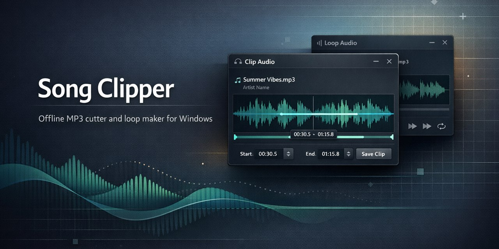

# Song Clipper

Offline Windows desktop app for cutting MP3 clips and creating repeated loop tracks.

If you are searching for an offline MP3 cutter, MP3 clipper, audio trimmer, MP3 loop maker, or a simple FFmpeg GUI for Windows, this repository is built for that workflow.

[](https://github.com/09ashishkapoor/music_clipper_local_offline/releases)
[](https://github.com/09ashishkapoor/music_clipper_local_offline/releases/latest)

Download the latest Windows installer: <https://github.com/09ashishkapoor/music_clipper_local_offline/releases/latest>




## Why This Repo Exists

Song Clipper gives you a small local GUI for two common audio tasks:

- Cut a precise section from an MP3.
- Repeat an MP3 into a longer looped output.

Everything runs locally on Windows. There is no upload step, no cloud dependency, and no telemetry.

## At a Glance

- Offline-first desktop app
- Windows-only
- MP3 input and MP3 output
- Drag and drop or file picker
- FFmpeg-powered processing
- Output saved next to the original file
- Portable `.exe` and installer packaging supported

## Who It Is For

- People who want a lightweight MP3 cutter without opening a full DAW
- Anyone creating meditation loops, practice loops, or repeated backing tracks
- Users who need a private local workflow for trimming audio on Windows
- Developers looking for a minimal Python + Tkinter + FFmpeg desktop utility

## Quick Start

### Requirements

- Windows 7 or later
- FFmpeg available either:
  - in your system `PATH`, or
  - in `tools/ffmpeg/` as `ffmpeg.exe` and `ffprobe.exe`

### Fastest Install Path

1. Open the latest release page.
2. Download the Windows installer attached to that release.
3. Install FFmpeg with `winget install Gyan.FFmpeg` if it is not already installed.
4. Launch Song Clipper from Start Menu or the installed app shortcut.

### Run From Source

```powershell
git clone https://github.com/09ashishkapoor/music_clipper_local_offline.git
cd music_clipper_local_offline
pip install -r requirements.txt
run_song_clipper.bat
```

### Install FFmpeg

Recommended on Windows:

```powershell
winget install Gyan.FFmpeg
```

Manual local setup also works:

1. Download FFmpeg from <https://ffmpeg.org/download.html> or <https://www.gyan.dev/ffmpeg/builds/>.
2. Copy `ffmpeg.exe` and `ffprobe.exe` into `tools/ffmpeg/`.

## What The App Does

### Clip Workflow

1. Drop one MP3 file into the app.
2. Enter `From` and `To` in `MM:SS` or `HH:MM:SS`.
3. Click `Extract`.
4. The clipped MP3 is saved next to the source file.

Example output:

```text
meditation-track-00-30-to-01-10.mp3
```

If that filename already exists, the app creates a unique sibling file such as:

```text
meditation-track-00-30-to-01-10-1.mp3
```

### Loop Workflow

1. Open the `Loop` tab.
2. Drop one MP3 file into the app.
3. Enter how many times the track should repeat.
4. Click `Create Loops`.
5. The looped MP3 is saved next to the source file.

Example output:

```text
meditation-track-loopx5.mp3
```

## Distribution Options

| Format | Best for | Python required | FFmpeg required |
|---|---|---|---|
| Source checkout | Development or local use | Yes, unless bundled runtime is present | Yes |
| `dist/SongClipper/` | Portable app folder | No | Yes |
| `installer_output/SongClipper-Setup-v2.0.0.exe` | End-user installation | No | Yes |

## Build A Portable `.exe`

```powershell
build.bat
```

This produces:

```text
dist/SongClipper/SongClipper.exe
```

Manual build:

```powershell
pip install pyinstaller
pyinstaller song_clipper.spec --clean --noconfirm
```

## Build A Windows Installer

Install Inno Setup:

```powershell
winget install JRSoftware.InnoSetup
```

Then run:

```powershell
iscc installer.iss
```

This produces:

```text
installer_output/SongClipper-Setup-v2.0.0.exe
```

## Tech Stack

- Python
- Tkinter
- `tkinterdnd2-universal`
- FFmpeg
- PyInstaller
- Inno Setup

## Project Structure

```text
music_clipper_local_offline/
  app/
    main.py
    ui.py
    cutter.py
    validation.py
    theme.py
  tools/
    ffmpeg/
  runtime/
  screenshots/
  build.bat
  installer.iss
  run_song_clipper.bat
  requirements.txt
```

## Limitations

- Windows only
- One file at a time
- MP3 workflow only
- FFmpeg is required

## Troubleshooting

If the app does not start:

- Check Python with `python --version`
- Check FFmpeg with `ffmpeg -version`
- Reinstall dependencies with `pip install -r requirements.txt --force-reinstall`

If drag and drop does not work:

- Verify `tkinterdnd2-universal` is installed
- Use the `Browse MP3` button instead

If FFmpeg is not detected:

- Add it to your system `PATH`, or
- place `ffmpeg.exe` and `ffprobe.exe` in `tools/ffmpeg/`

## License

MIT. See [LICENSE](LICENSE).

## Contributing

Issues and pull requests are welcome.
